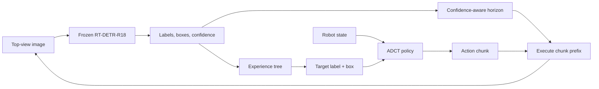

# ADCT

Reference implementation of **Action and Detection Chunking with Transformers
Based on Experience Tree**, accepted by *IEEE Robotics and Automation Letters*
(RA-L), 2026.

[](https://doi.org/10.1109/LRA.2026.3706944)
[](LICENSE)
[](pyproject.toml)

[中文说明](README_zh-CN.md)

**Paper:** [IEEE Xplore](https://ieeexplore.ieee.org/document/11576545) · [DOI](https://doi.org/10.1109/LRA.2026.3706944)

ADCT is a lightweight imitation-learning framework for multi-object
classification and grasping. It replaces global RGB embeddings with semantic
detection primitives selected by an experience tree, then shortens the action
execution horizon when detector confidence is low.

## Demo video

https://github.com/user-attachments/assets/c1eadb46-9510-4b8f-8810-66854495fae1



## Highlights

- **Semantic experience tree.** Learns the ordered first entry of object
  categories into the placement region and forwards only the current target.
- **Image-free policy input.** Class one-hot vectors and boxes are encoded
  separately, balanced, and concatenated with the robot state.
- **Confidence-aware stepping.** Implements Equation (3) from the paper:

  \[
  S =
  \begin{cases}
  \max(1, \lfloor K-r(1-c)\rfloor), & c<c_{\mathrm{th}}\\
  K, & c\ge c_{\mathrm{th}}.
  \end{cases}
  \]

- **Low-data operation.** The paper reports more than 90% success with eight
  demonstrations in its low-shot setting.
- **Real-time inference.** The paper reports 31 ms per frame on an RTX 4060.

## Main results

The following success rates are reported in the paper over real-robot
roll-outs:

| Method | Dataset A, one scene | Dataset A, multi-scene | Dataset B, one scene | Dataset B, multi-scene |
|---|---:|---:|---:|---:|
| ACT | 62% | 8% | 65% | 22% |
| Diffusion Policy | 57% | 9% | 56% | 18% |
| ET + Diffusion Policy | 89% | 82% | 89% | 88% |
| **ADCT** | **96%** | **88%** | **96%** | **91%** |

See [the reproduction guide](docs/REPRODUCTION.md) for the evaluation protocol
and all paper hyperparameters.

## Repository layout

```text
.
├── configs/                 # Paper and detector configurations
├── docs/                    # Data, reproduction, and deployment guides
├── examples/                # Integration examples
├── src/
│   ├── adct/                # Experience tree, policy, runtime, and CLIs
│   └── RT_DETR/             # Vendored inference backend (Apache-2.0)
└── tests/                   # Unit and integration tests
```

The publication code was cleaned from an internal LeRobot experiment
workspace based on commit `5e947380`. The public package isolates the ADCT
algorithm from robot-specific paths and does not require a modified LeRobot
fork for policy training. A LeRobot dataset can be exported to the documented
manifest format with [the provided example](examples/export_lerobot_manifest.py).

## Installation

Python 3.10–3.12 and PyTorch 2.2 or newer are recommended.

```bash
conda create -n adct python=3.10
conda activate adct
pip install -e .
```

For development:

```bash
pip install -e ".[dev]"
pytest
ruff check src tests examples
```

Install a CUDA-enabled PyTorch build appropriate for your machine before
installing ADCT if the default wheel is not suitable.

## Required artifacts

Large artifacts are intentionally excluded from Git:

| Artifact | Expected location | Public link |
|---|---|---|
| Fine-tuned RT-DETR-R18 checkpoint | `weights/rtdetr_r18_adct.pth` | To be released |
| ADCT policy checkpoint | `weights/adct_policy/` | To be released |
| Demonstration/evaluation data | User-selected path | To be released |

The detector loader accepts the original experiment checkpoint dictionary
format (`model` or EMA `ema.module`). Do not commit checkpoints directly;
publish them through a GitHub Release, Git LFS, or the Hugging Face Hub.

## Data preparation

ADCT uses a detector-independent JSONL manifest. Each line contains one
demonstration frame:

```json
{
  "episode_index": 0,
  "frame_index": 12,
  "state": [0.1, 0.2, 0.3, 0.4, 0.5, 0.6],
  "action": [0.1, 0.2, 0.3, 0.4, 0.5, 0.6],
  "detections": [
    {"label": 0, "box": [120, 80, 180, 150], "score": 0.97}
  ]
}
```

Boxes use pixel-space `xyxy` coordinates. See
[the data-format guide](docs/DATA_FORMAT.md) and the LeRobot exporter for
details.

Build the experience tree:

```bash
adct-build-tree \
  --manifest data/demonstrations.jsonl \
  --config configs/adct_so100.yaml \
  --output data/experience_tree.json
```

Create action chunks and filtered semantic inputs:

```bash
adct-prepare-data \
  --manifest data/demonstrations.jsonl \
  --config configs/adct_so100.yaml \
  --output data/adct_train.npz \
  --image-width 640 \
  --image-height 480
```

The target center in `configs/adct_so100.yaml` is a placeholder. Set it to the
placement-container center measured in the top-view camera before preparing
data.

## Training

The default configuration matches the paper: batch size 16, learning rate
`1e-5`, approximately 200 epochs, action chunk size 50, and a four-layer
encoder/four-layer CVAE encoder.

```bash
adct-train \
  --config configs/adct_so100.yaml \
  --dataset data/adct_train.npz \
  --output-dir outputs/adct
```

Checkpoints are stored as `safetensors` plus JSON model configuration and
state/action normalization statistics:

```bash
adct-inspect outputs/adct
```

## Inference

```python
import torch

from adct.checkpoint import load_checkpoint
from adct.config import ExperimentConfig, resolve_project_path
from adct.detector import RTDETRDetector
from adct.experience_tree import ExperienceTree
from adct.runtime import ADCTRuntime

project_root = "."
cfg = ExperimentConfig.from_yaml("configs/adct_so100.yaml")
model = load_checkpoint("weights/adct_policy", device="cuda")
tree = ExperienceTree.load("data/experience_tree.json")
detector = RTDETRDetector(
    resolve_project_path(cfg.detector.config, project_root),
    resolve_project_path(cfg.detector.checkpoint, project_root),
    device=cfg.detector.device,
    input_size=cfg.detector.input_size,
    score_threshold=cfg.detector.score_threshold,
    top_k=cfg.detector.top_k,
    use_amp=cfg.detector.use_amp,
)
runtime = ADCTRuntime(model, detector, tree, cfg.dynamic_horizon)

# Call runtime.reset() at every episode boundary.
# image: float tensor (3, H, W); robot_state: tensor (state_dim,)
action = runtime.step(image, robot_state)
```

Robot I/O is intentionally kept outside the algorithm package. Integrate
`runtime.step` into your control loop and call `runtime.reset()` at each
episode boundary. Read [the deployment guide](docs/ROBOT_DEPLOYMENT.md) before
running on hardware.

## Reproducibility status

- [x] Explicit experience-tree construction and serialization
- [x] Balanced label/box encoder
- [x] ACT-style CVAE transformer and paper loss
- [x] Score-driven action horizon
- [x] Frozen RT-DETR-R18 loader without personal absolute paths
- [x] Training/data CLIs and unit tests
- [ ] Public detector and policy checkpoints
- [ ] Public demonstration/evaluation datasets
- [x] Supplementary demo video
- [ ] High-resolution project figure

The remaining unchecked items are author-hosted artifacts, not source-code
dependencies.

## Citation

```bibtex
@article{wang2026adct,
  title   = {Action and Detection Chunking with Transformers Based on Experience Tree},
  author  = {Wang, Bo and Zhan, Guozhi and Shang, Jun and Liu, Qinyuan},
  journal = {IEEE Robotics and Automation Letters},
  year    = {2026},
  doi     = {10.1109/LRA.2026.3706944}
}
```

## Acknowledgments and license

The implementation builds on ideas and Apache-2.0 code from
[LeRobot](https://github.com/huggingface/lerobot) and uses the official
[RT-DETR](https://github.com/lyuwenyu/RT-DETR) inference implementation.
See [NOTICE](NOTICE) for provenance details.

ADCT is released under the [Apache License 2.0](LICENSE).

