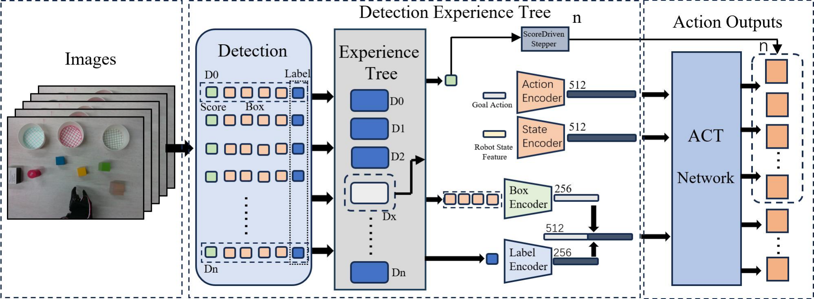

# ADCT

这是论文 **Action and Detection Chunking with Transformers Based on
Experience Tree** 的整理版参考实现。论文已被 *IEEE Robotics and Automation
Letters*（RA-L）接收，DOI：
[10.1109/LRA.2026.3706944](https://doi.org/10.1109/LRA.2026.3706944)。

[English](README.md)

**论文：** [IEEE Xplore](https://ieeexplore.ieee.org/document/11576545) · [DOI](https://doi.org/10.1109/LRA.2026.3706944)

ADCT 面向多物体分类抓取任务。它不把全局 RGB 特征直接输入策略，而是利用经验树从
RT-DETR 的检测结果中选择当前任务目标；当检测置信度较低时，系统会缩短当前动作块
的执行长度，以更早重新感知和规划。

**方法与工程基础：** ADCT 建立在 [Action Chunking with Transformers
（ACT）](https://arxiv.org/abs/2304.13705) 之上；实验代码与训练流程基于
[Hugging Face LeRobot](https://github.com/huggingface/lerobot) 提供的 ACT 实现进行开发。

## Demo Video / 演示视频

https://github.com/user-attachments/assets/c1eadb46-9510-4b8f-8810-66854495fae1

> [!IMPORTANT]
> **当前开源范围：** 当前版本仅支持使用人工指定的经验树，或基于预先导出的检测语义
> 构建经验树；论文中直接从原始示范视频自主构建经验树的完整流程尚未开源。

## 方法概览



## 主要模块

- `ExperienceTree`：从预先导出的检测结果中提取物体类别首次进入目标区域的顺序，并
  在推理时只输出当前优先级最高、尚未放置的物体。
- `DetectionFeatureEncoder`：分别编码类别 one-hot 特征和边界框特征，避免策略只依赖
  类别或位置中的某一种信息。
- `ADCT`：不使用 RGB 编码器的 ACT/CVAE Transformer，输入为机器人状态和经验树筛选
  后的语义检测特征。
- `ActionChunkBuffer`：严格实现论文公式，根据检测置信度动态确定动作块执行长度。
- `RTDETRDetector`：冻结的 RT-DETR-R18 推理封装，权重路径、设备和阈值均通过配置
  指定，不包含个人绝对路径。

## 安装

推荐 Python 3.10–3.12：

```bash
conda create -n adct python=3.10
conda activate adct
pip install -e .
```

开发与测试：

```bash
pip install -e ".[dev]"
pytest
ruff check src tests examples
```

## 数据格式

整理版使用与具体机器人框架解耦的 JSONL 清单。每行对应一个示范帧：

```json
{
  "episode_index": 0,
  "frame_index": 12,
  "state": [0.1, 0.2, 0.3, 0.4, 0.5, 0.6],
  "action": [0.1, 0.2, 0.3, 0.4, 0.5, 0.6],
  "detections": [
    {"label": 0, "box": [120, 80, 180, 150], "score": 0.97}
  ]
}
```

边界框采用像素坐标 `xyxy`。已有 LeRobot 数据可通过
[导出示例](examples/export_lerobot_manifest.py) 转换。完整定义见
[数据格式说明](docs/DATA_FORMAT.md)。

## 构建经验树与训练数据

首先修改 `configs/adct_so100.yaml` 中的目标容器中心坐标；文件中的
`(320, 240)` 只是占位值。

```bash
adct-build-tree \
  --manifest data/demonstrations.jsonl \
  --config configs/adct_so100.yaml \
  --output data/experience_tree.json

adct-prepare-data \
  --manifest data/demonstrations.jsonl \
  --config configs/adct_so100.yaml \
  --output data/adct_train.npz \
  --image-width 640 \
  --image-height 480
```

## 训练

默认配置对应论文主要设置：动作块长度 50、batch size 16、学习率 `1e-5`、训练约
200 个 epoch。

```bash
adct-train \
  --config configs/adct_so100.yaml \
  --dataset data/adct_train.npz \
  --output-dir outputs/adct
```

权重以 `safetensors` 保存，同时保留模型配置和状态/动作归一化统计；可以用以下命令检查：

```bash
adct-inspect outputs/adct
```

## 运行时接入

核心接口为：

```python
action = runtime.step(image, robot_state)
```

其中 `image` 为 `(3, H, W)` 图像张量，`robot_state` 为一维机器人状态。每个新
episode 开始前必须调用 `runtime.reset()`。SO100 与相机接入、安全检查和动态步长
说明见[机器人部署文档](docs/ROBOT_DEPLOYMENT.md)。

## 尚需发布的大文件

源码已经与大文件解耦，下列内容需要由论文作者选择托管位置：

- 微调后的 RT-DETR-R18 权重；
- 论文主模型 ADCT 权重；
- 示范与评测数据集。

这些文件不应直接提交到普通 Git 历史，建议使用 Hugging Face Hub、Git LFS 或
GitHub Release。

## 引用

如果您使用本项目，请引用 ADCT 论文。由于本工作建立在 ACT 和 LeRobot 之上，也请
同时引用 ACT 论文与 LeRobot 项目。

```bibtex
@article{wang2026adct,
  title   = {Action and Detection Chunking with Transformers Based on Experience Tree},
  author  = {Wang, Bo and Zhan, Guozhi and Shang, Jun and Liu, Qinyuan},
  journal = {IEEE Robotics and Automation Letters},
  year    = {2026},
  doi     = {10.1109/LRA.2026.3706944}
}

@inproceedings{zhao2023learning,
  title     = {Learning Fine-Grained Bimanual Manipulation with Low-Cost Hardware},
  author    = {Zhao, Tony Z. and Kumar, Vikash and Levine, Sergey and Finn, Chelsea},
  booktitle = {Robotics: Science and Systems},
  year      = {2023}
}

@misc{cadene2024lerobot,
  title        = {LeRobot: State-of-the-art Machine Learning for Real-World Robotics in Pytorch},
  author       = {Cadene, Remi and Alibert, Simon and Soare, Alexander and Gallouedec, Quentin and Zouitine, Adil and Palma, Steven and Kooijmans, Pepijn and Aractingi, Michel and Shukor, Mustafa and Aubakirova, Dana and Russi, Martino and Capuano, Francesco and Pascal, Caroline and Choghari, Jade and Meftah, Khalil and Ellerbach, Maxime and Moss, Jess and Wolf, Thomas},
  howpublished = {\url{https://github.com/huggingface/lerobot}},
  year         = {2024}
}
```

## 致谢与许可证

ADCT 建立在 ACT（[论文](https://arxiv.org/abs/2304.13705)、
[官方实现](https://github.com/tonyzhaozh/act)）之上；实验代码与公开实现使用了
[LeRobot](https://github.com/huggingface/lerobot) 中的 ACT 策略与训练基础设施。
检测器后端使用 [RT-DETR](https://github.com/lyuwenyu/RT-DETR) 官方实现。感谢这些
项目的作者。

本项目采用 [Apache License 2.0](LICENSE)。完整的第三方代码来源和许可证信息见
[NOTICE](NOTICE)。

